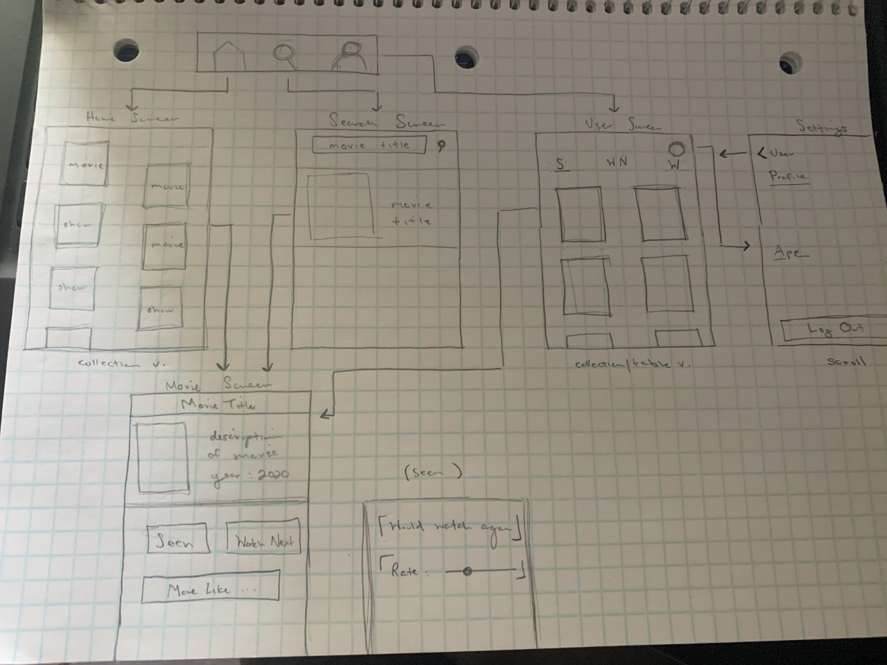
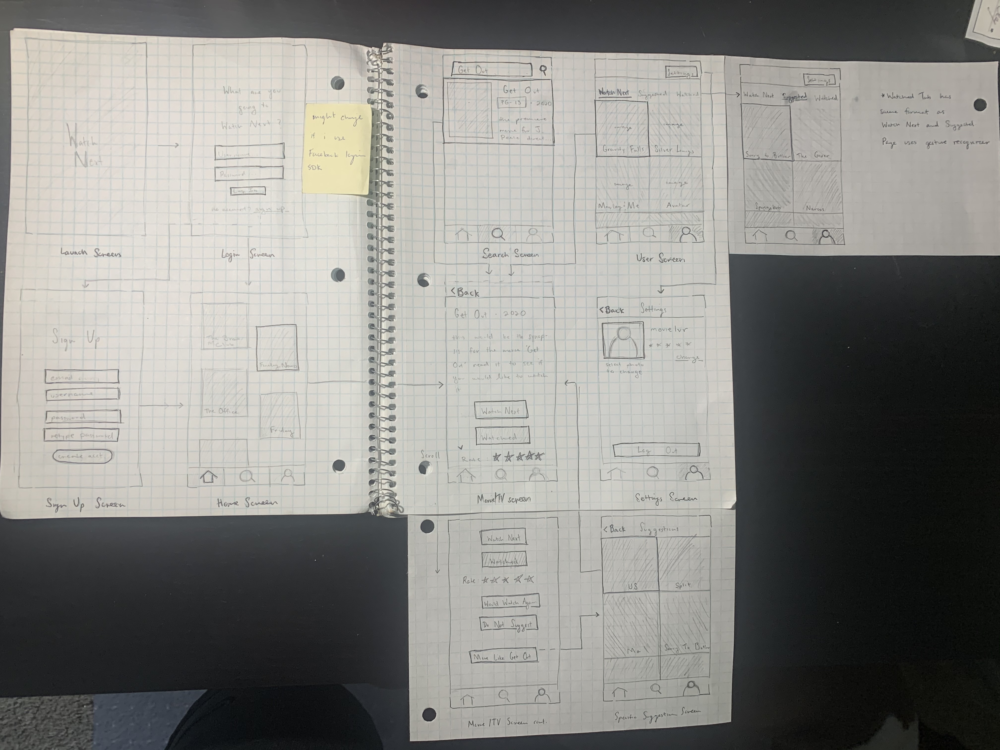
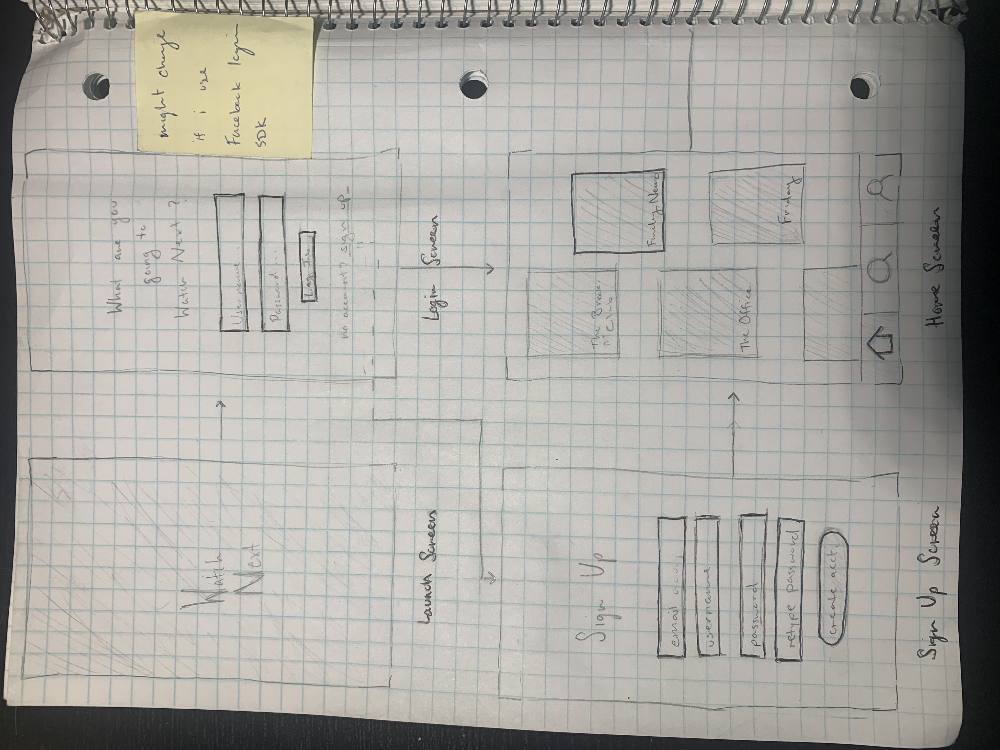
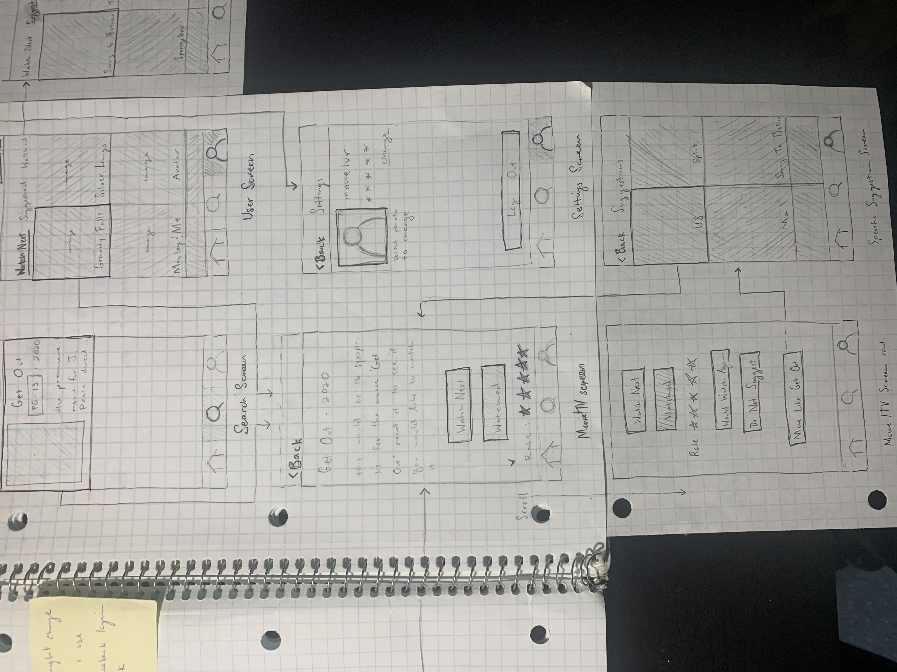
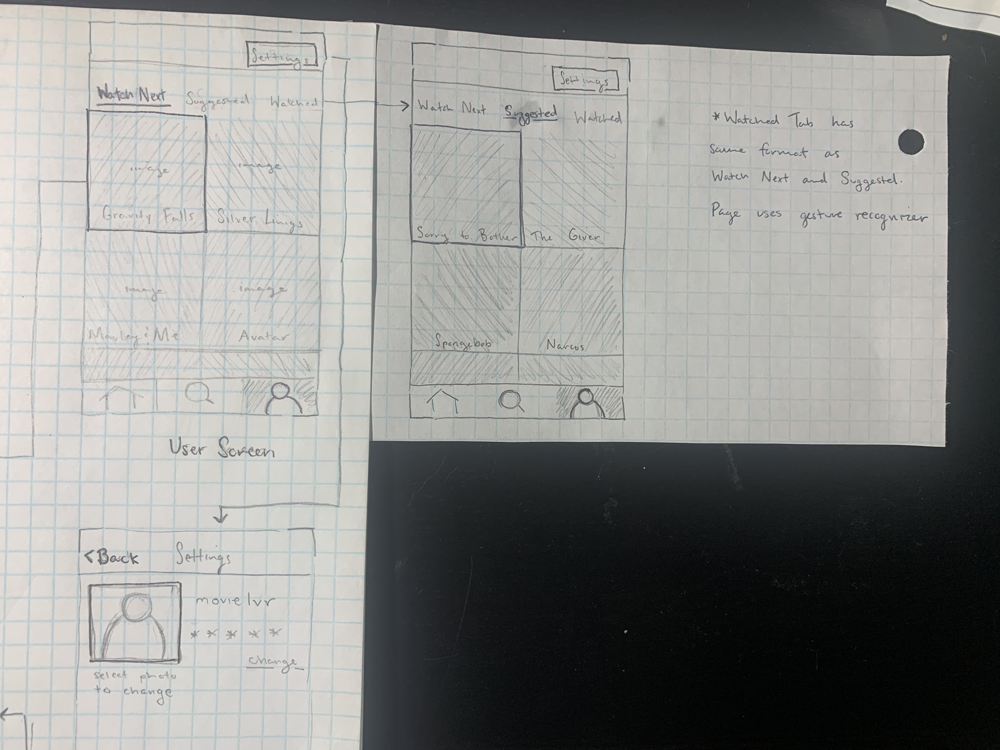

# Watch Next

## Table of Contents
1. [Overview](#Overview)
1. [Product Spec](#Product-Spec)
1. [Wireframes](#Wireframes)
2. [Schema](#Schema)

## Overview
### Description

Watch Next is a mobile app that allows users to keep track of movies and TV shows that they have watched and would like to watch. Watch Next then curates a suggestions list for the user to provide them with options they may have not come accross on their own.

### App Evaluation
[Evaluation of your app across the following attributes]
- **Category:** Entertainment 
- **Mobile:** Mobile focused design. 
- **Story:** The app allows users to easily log and rate anything they have watched to provide a personalized suggestions list. Users can also see what friends have logged in order to acquire suggestions.
- **Market:** The app's potential user base consists of cinema watchers who may not be satisfied with the suggestions of individual streaming service suggestions. The app is targeted towards users who use multiple streaming services such as Netflix and Hulu.
- **Habit:** The Average User would use this app whenever they finish a TV show or movie. Multiple times a week.
- **Scope:** The app may have to interact with multiple API's in order to have access to a wholesome list of movies/TV shows. The more complex side to the project is creating a solid suggestions list. 

## Product Spec

### 1. User Stories (Required and Optional)

**Required Must-have Stories**

* User can create new Watch Next profile.
* User can use camera to set profile picture.
* User can log in/out of their Watch Next profile.
* User can sign up/log in with Facebook via the Facebook SDK.
* User can search for movie/TV show Title and get correct results.
* User can mark a movie/TV show as watched.
* User can mark a movie/TV show as watch next.
* User can rate their watched movies/TV shows on a scale of 1 to 5 stars.
* User can mark watched movie/TV show as 'would/wouldn't watch again.'
* User can see suggested movies/TV shows based off of a specific watched movie/TV show.
* User can view their Watched/ Watch Next Lists.
* User can view a more curated suggestions list based off of their entire watched list and its internal ratings. (complex algorithm implementation)


**Optional Nice-to-have Stories**

* User can view another user's watched list. 
* User can get an automatic comparison of watched/ watch next lists with other users. e.g 'You and User2 have both watched The Office'
* The app will ask user 'Have you watched [this suggested movie] based on [this movie on your watched list]?'
* User can suggest movie/TV show to another specific user.
* User can mark what streaming platform they watched the movie/TV show on (if applicable).
* Users can talk about a specific movie/TV show in a spoilers section.
* User can set their 'favorite movie'. 

### 2. Screen Archetypes

* Registration Screen 
   * User can create new Watch Next profile
   * User can use camera to set profile picture.
* Login Screen
   * User can login to their Watch Next Profile
* Search Screen 
   * User can search for movie/TV show Title and get correct results.
* Movie/TV Screen
   * User can mark a movie/TV show as watched.
   * User can mark a movie/TV show as watch next.
   * User can rate thier watched movies/TV shows on a scale of 1 to 5 stars.
   * User can mark watched movie/TV show as 'would/wouldn't watch again.'
   * User can see suggested movies/TV shows based off of a specific watched movie/TV show.
* User Proile Screen
   * User can view their Watched/ Watch Next/ Suggested Lists.

  

### 3. Navigation

**Tab Navigation** (Tab to Screen)

* Home [maybe like a Tinder/Bumble design concept, but with movies]
* Search
* User Profile

**Flow Navigation** (Screen to Screen)

* Home
   * Movies/TV
* Search
   * Movies/TV
   * [optional user story: see Other User Profiles]
* User Profile
    * Watched  > Movies/TV
    * Watch Next  > Movies/TV
    * Settings


## Wireframes
07 July 2020




10 July 2020


    


29 July 2020


## Schema 

### Models

Model: User


| Property      | Type          | Description  |
| ------------- |:-------------:| -----|
| object ID | String | unique user id created by Parse |
| email     | String | User’s email they used to sign up and log in |
| username     | String | User’s chosen username |
| password      | String      |   User’s password they used to sign up and login |
| profilePicture      | File      |   User's profile picture |
| watched	| Relation <Ratings> | List of movies/tv shows a user has marked as watched
| watchNext | Relation <Ratings>  | List of movies/tv shows the user has marked as watchNext
| ?suggestedShows? |	?? | List of shows that the app has deemed suggestible to the user


Model: Interaction


| Property      | Type          | Description  |
| ------------- |:-------------:| -----|
| object ID | String | unique rating id created by Parse |
| creator     | Pointer <User> | User that created the rating |
| API ID     | String | The id that can be used for API calls to retrieve info about the media |
| type     | ENUM | Movie or TV Show |
| interactionType     | ENUM | Signifies if the user is adding to watched list or watch next list|
| stars     | Number | User rating of show on a scale of (1-5) |
| wouldWatchAgain | ENUM  |	Specifies if a USER has selected that they would or would not watch this show again.


## Network Requests and Code Snippets

### Login Screen

   - (Read/GET) Query user where username and password match the user input.
   
```
NSString *username = self.usernameField.text;
NSString *password = self.passwordField.text;

[PFUser logInWithUsernameInBackground:username password:password block:^(PFUser * user, NSError *  error) {

            if (error != nil){
            
                alert.message = error.localizedDescription;
                
                [self presentViewController:alert animated:YES completion:^{
                
                    }];  
                    
            }
            
            else{
            
                [self performSegueWithIdentifier:@"loginSegue" sender:nil];
                
            }
        }];

```
### Sign Up Screen
   
   - (Create/POST) Creating a new user.

```
NSString *username = self.usernameField.text;

NSString *password = self.passwordField.text;


[newUser signUpInBackgroundWithBlock:^(BOOL succeeded, NSError * _Nullable error) {

           if (error != nil){
           
               alert.message = error.localizedDescription;
               
               [self presentViewController:alert animated:YES completion:^{
               
               }];
               
           }
           
           else{
           
               [self performSegueWithIdentifier:@"loginSegue" sender:nil];
               
           }
           
        }];
```

### User Screen

   - (Read/GET) Query user properties for current user. (Watch Next and Watched)
   
```
    PFQuery *userQuery = [User query];
    
    [postQuery orderByDescending:@"createdAt"];
    
    [postQuery includeKey:@“watchNextMovies”];
    
    [postQuery includeKey:@“watchedMovies”];
    
    [postQuery includeKey:@“watchNextShows”];
    
    [postQuery includeKey:@“watchedShows”];
    

    [postQuery findObjectsInBackgroundWithBlock:^(NSArray User* _Nullable user, NSError * _Nullable error) {
    
        if(user)
        
        {
        }


    }];
```

### Movie/ TV Show Screen

   - (Read/GET) Search if the the movie/TV show is already marked as watched and rated.
    
```   
PFQuery *query [PFQuery queryWithClassName: @“Ratings”];

[query whereKey: @“author” equalTo: [PFUser currentUser]];

[query whereKey: @“movie” equalTo: selectedMovie];


[query findObjectsInBackgroundWithBlock:^(NSArray *ratings, NSError *error) {

    if(ratings){
    
	       for(PFObject *o in objects) 
         {
         
             PFObject *starRating = [o objectForKey: @“stars”];
             
             BOOL *watchAgain = [o objectForKey: @“watchAgain”];
             
          }
          
    }
    
    else
    {   // the user has not marked this movie as watched }

   
}];
```

   - (Read/GET) Search if the the movie/TV show is already marked as Watch Next.
    
```
PFRelation *relation2 = [watcher relationFOrKey:@“watchNextMovies”]

PFQuery *query2 = [relation query2];

[query2 whereKey: @“movie” equalTo: selectedMovie];


[query2 findObjectsInBackgroundWithBlock:^(NSArray User* _Nullable user, NSError * _Nullable error) {

        if(user)
        
        {
        }
        

    }];
```


Creating a Rating

   - (Update/PUT) Add to the user Watched List. (Repeat for TV Shows)

```
PFUser *user = [PFUser currentUser];

PFRelation *relation = [user relationForKey:@“watchedMovies”];

[relation addObject: selectedMovie];

[user saveInBackgroundWithBlock:^(BOOL succeeded, NSError * _Nullable error) {

}];

```

  - (Create/POST) Create a Ratings object for the Watched Movie.  (Repeat for TV Shows)
    
```
 (void) addToWatched ( PFObject * _Nullable)movie  withCompletion: (PFBooleanResultBlock _Nullable)completion{
    
    Rating *newRating = [Rating new];
    
    newRating.stars = 
    
    newRating.author = [PFUser currentUser];
    
    newRating.movie = 
    
    newShow.show = 
    
    newPost.watchAgain = 
    
    
    [newRating saveInBackgroundWithBlock:completion];

    PFRelation *relation = [user relationForKey:@“watchedMovies”];
    
    [relation addObject: movie];

    [user saveInBackgroundWithBlock:^(BOOL succeeded, NSError * _Nullable error) {
    
     }];
   

}
```

### Settings Screen

   - Logging current user out. 
   
```
[PFUser logOutInBackgroundWithBlock:^(NSError * _Nullable error) {

        //current user is now nil
        
    }];
    
```   
   - (Update/PUT) Change current user's profile picture.
 

- [OPTIONAL: List endpoints if using existing API such as Yelp]
